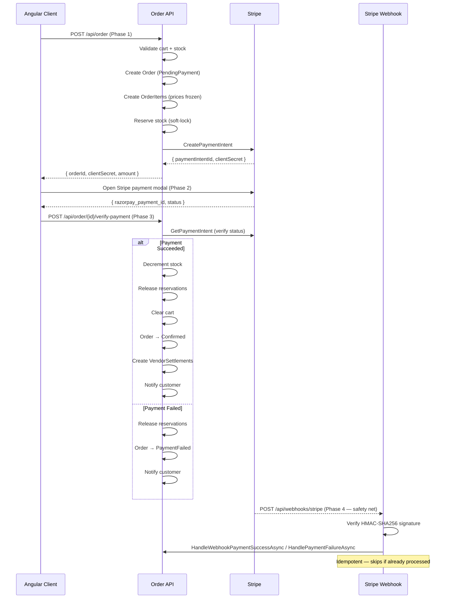
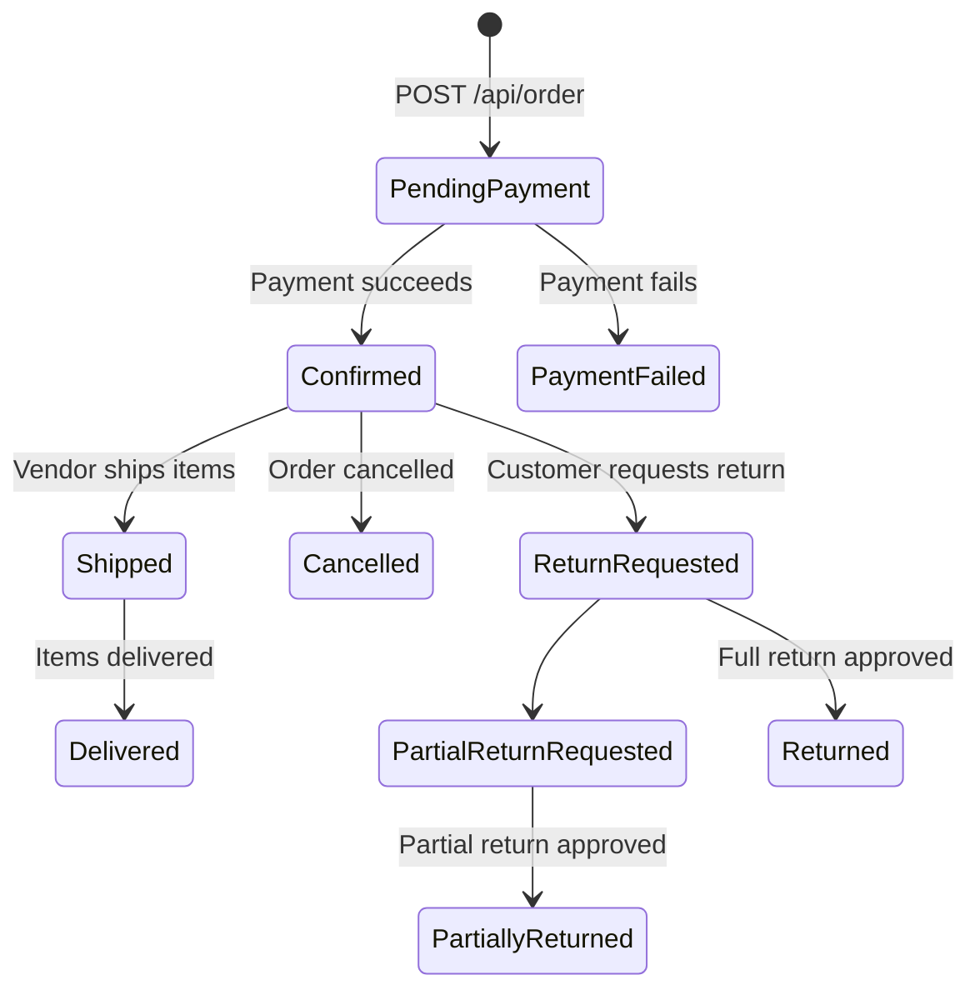

# Order Flow — Ecommerce Platform

This document describes the complete lifecycle of an order: from cart checkout through Stripe payment, webhook safety net, and vendor settlement.

---

## Overview

The order system uses a **4-phase optimistic payment model** with Stripe as the payment gateway. The key design goals are:

- **Optimistic creation**: The order and its items are created before payment, so prices are frozen immediately and stock is soft-locked to prevent over-selling.
- **Idempotency**: Both the client verify-payment endpoint and the webhook can handle the same event multiple times safely.
- **Resilience**: The Stripe Webhook (Phase 4) acts as a safety net — it catches cases where the client crashes or the user closes the browser mid-payment.



---

## Phase 1: Order Creation (Optimistic)

**Endpoint**: `POST /api/order`  
**Auth**: Customer only  
**Code**: [OrderService.CreateOrder](file:///Users/dharshinik/Desktop/Presidio/Genspark/Ecommerce/Ecommerce.BLL/OrderService.cs#L62-L218)

### Steps

1. **Load cart** with all relationships (cart items → variant → product → vendor).
2. **Validate stock (read-only check)**: Every item's `StockQty` must be ≥ the requested quantity. Items must be active. No quantities are decremented yet.
3. **Resolve promo code** (optional): If a promo code is provided, it is validated and the discount amount is computed — either a flat deduction or a percentage of the subtotal.
4. **Calculate financials**:
   - Items are grouped by vendor — one shipment is created per vendor.
   - Shipping fee = **5% of that vendor's item subtotal** (`VendorShippingRate = 0.05`).
   - Tax = **18% GST** applied after discount (`TaxRate = 0.18`).
   - `Total = (Subtotal - Discount) + Tax + Shipping`
5. **DB Transaction** — all the following steps run inside a single EF Core transaction:
   - **Create a placeholder Payment** (`Status = Pending`, `TransactionId = "PENDING-<guid>"`) — needed as an FK before the Stripe call.
   - **Create Order** (`Status = PendingPayment`).
   - **Create one Shipment per vendor** (`Status = Pending`, estimated fulfilment = 7 days).
   - **Create OrderItems**: Unit prices are **frozen** at the current variant price at this moment.
   - **Reserve stock (soft-lock)**: `StockReservation` rows are created per cart item — these prevent over-selling while the customer completes payment.
   - **Create Stripe PaymentIntent** with the total amount (converted to paise).
   - **Persist `StripePaymentIntentId`** on the Order — used for idempotency later.
6. **Return** `{ orderId, clientSecret, stripePaymentIntentId, amount, currency }` to the client.

### Key Data Created

| Entity | Value |
|---|---|
| `Order.Status` | `PendingPayment` |
| `Payment.Status` | `Pending` |
| `Shipment.Status` | `Pending` |
| `StockReservation.IsReleased` | `false` |
| `OrderItem.UnitPrice` | Frozen at current `Variant.Price` |

---

## Phase 2: Client-Side Payment

This phase is entirely handled by the **Angular frontend** and **Stripe's hosted checkout modal**.

1. The Angular client receives the `clientSecret` from Phase 1.
2. It opens the **Stripe payment modal** using the `clientSecret`.
3. The customer enters payment details and submits.
4. Stripe processes the card and returns `{ stripePaymentIntentId, status }` to the client.
5. No backend calls are made in this phase.

> If the browser crashes or the user closes the window at this point, **Phase 4 (Webhook)** acts as the safety net.

---

## Phase 3: Server-Side Payment Verification

**Endpoint**: `POST /api/order/{orderId}/verify-payment`  
**Auth**: Customer only (must own the order)  
**Code**: [OrderService.VerifyPaymentAsync](file:///Users/dharshinik/Desktop/Presidio/Genspark/Ecommerce/Ecommerce.BLL/OrderService.cs#L224-L266)

The Angular client calls this endpoint immediately after the Stripe modal closes.

### Steps

1. **Load the order** and verify it belongs to the current user.
2. **Idempotency guard**: If the order is already `Confirmed`, return success immediately without doing anything again.
3. **Verify with Stripe**: Call `GetPaymentIntentAsync` to fetch the real status of the PaymentIntent from Stripe.

#### On Success (`status == "succeeded"`) → [`ProcessPaymentSuccessAsync`](file:///Users/dharshinik/Desktop/Presidio/Genspark/Ecommerce/Ecommerce.BLL/OrderService.cs#L300-L423)

All steps run inside a DB transaction:

1. **Decrement actual `StockQty`** for each ordered item (true stock reduction happens here, not earlier).
2. **Release stock reservations** (`StockReservation.IsReleased = true`).
3. **Clear the customer's cart** (all `CartItem` rows deleted).
4. **Update Payment** → `Status = Paid`, `TransactionId = stripePaymentIntentId`.
5. **Confirm Order** → `Status = Confirmed`.
6. **Update Shipments** → `Status = Initiated`.
7. **Create VendorSettlements** (one per vendor — see [Settlement Calculation](#settlement-calculation)).
8. **Send notification** to the customer: *"Order Confirmed!"*.

#### On Failure → [`ProcessPaymentFailureAsync`](file:///Users/dharshinik/Desktop/Presidio/Genspark/Ecommerce/Ecommerce.BLL/OrderService.cs#L425-L466)

1. **Release stock reservations** — reserved items are made available again.
2. **Update Order** → `Status = PaymentFailed`.
3. **Update Payment** → `Status = Failed`.
4. **Send notification** to the customer: *"Payment Failed"*.

---

## Phase 4: Stripe Webhook (Safety Net)

**Endpoint**: `POST /api/webhooks/stripe`  
**Auth**: None (verified via HMAC-SHA256 signature)  
**Code**: [StripeWebhookController](file:///Users/dharshinik/Desktop/Presidio/Genspark/Ecommerce/Ecommerce.API/Controllers/StripeWebhookController.cs)

Stripe independently sends webhook events to this endpoint. This **catches all cases that Phase 3 misses** — e.g., the user closes the browser after paying, the client crashes, or a network drop after the Stripe modal closes.

### Signature Verification

The raw request body is read (not parsed by middleware) and verified against the `Stripe-Signature` header using HMAC-SHA256 with the configured `WebhookSecret`. Any request with an invalid signature is rejected with `400 Bad Request`.

### Event Routing

| Stripe Event | Handler |
|---|---|
| `payment_intent.succeeded` | `HandleWebhookPaymentSuccessAsync` |
| `payment_intent.payment_failed` | `HandlePaymentFailureAsync` |
| Anything else | Ignored (returns `200 OK` to prevent Stripe retrying) |

### Idempotency

Both handlers check if the order/payment is already in the terminal state before doing any work:
- **Success handler**: Skips if `Payment.Status == Paid` or `Order.Status == Confirmed`.
- **Failure handler**: Skips if `Order.Status == PaymentFailed` or `Order.Status == Confirmed`.

This makes the webhook safe to be called multiple times (Stripe retries on non-2xx responses).

> **Important**: The endpoint always returns `200 OK` to Stripe — even if an internal error occurs — to prevent Stripe from retrying indefinitely for an unprocessable event.

---

## Settlement Calculation

When a payment succeeds, a `VendorSettlement` record is created for **each vendor** whose items are in the order.

**Code**: [ProcessPaymentSuccessAsync — Settlement Section](file:///Users/dharshinik/Desktop/Presidio/Genspark/Ecommerce/Ecommerce.BLL/OrderService.cs#L368-L401)

### Formula

```
GrossAmount         = sum(UnitPrice × Quantity) for this vendor's items
VendorShipping      = GrossAmount × 5%
VendorDiscountShare = DiscountAmount × (GrossAmount / OrderSubtotal)   ← proportional share of promo discount
CommissionBase      = GrossAmount + VendorShipping − VendorDiscountShare
PlatformCommission  = CommissionBase × 5%
NetPayoutAmount     = CommissionBase − PlatformCommission
```

### Settlement Fields

| Field | Description |
|---|---|
| `GrossAmount` | Total item revenue for this vendor |
| `ShippingAmount` | Vendor's share of shipping (5% of their gross) |
| `VendorDiscountAmount` | Vendor's proportional share of the promo discount |
| `PlatformCommissionAmount` | Platform's 5% cut |
| `NetPayoutAmount` | What the vendor receives |
| `TransactionReference` | Stripe PaymentIntent ID for traceability |
| `Status` | Starts as `Pending`; becomes `Paid` once settled |

---

## Data Models

### [Order](file:///Users/dharshinik/Desktop/Presidio/Genspark/Ecommerce/Ecommerce.Models/Order.cs)

| Field | Description |
|---|---|
| `Status` | `PendingPayment` → `Confirmed` / `PaymentFailed` → `Shipped` → `Delivered` |
| `OrderPaymentStatus` | Mirrors the linked `Payment.Status` |
| `StripePaymentIntentId` | Used for idempotency lookups |
| `Subtotal` | Sum of all item prices × quantities |
| `DiscountAmount` | Amount deducted by promo code |
| `TaxAmount` | 18% GST on taxable amount |
| `ShippingAmount` | Total shipping across all vendors |
| `Total` | Final amount charged |

### [OrderItem](file:///Users/dharshinik/Desktop/Presidio/Genspark/Ecommerce/Ecommerce.Models/Order.cs#L53-L72)

| Field | Description |
|---|---|
| `UnitPrice` | Price frozen at the time of order creation |
| `VendorId` | Vendor who owns this item |
| `ShipmentId` | Linked to the vendor's shipment for this order |

### [StockReservation](file:///Users/dharshinik/Desktop/Presidio/Genspark/Ecommerce/Ecommerce.Models/StockReservation.cs)

A soft-lock on stock created during Phase 1. Released (marked `IsReleased = true`) after payment success or failure — stock is never physically decremented until payment is confirmed.

| Field | Description |
|---|---|
| `IsReleased` | `false` = active lock; `true` = released after payment outcome |
| `ReleasedAt` | Timestamp when the reservation was lifted |

---

## Order Status Lifecycle



---

## API Endpoints

| Method | Endpoint | Role | Description |
|---|---|---|---|
| `POST` | `/api/order` | Customer | Create order from cart (Phase 1) |
| `POST` | `/api/order/{id}/verify-payment` | Customer | Verify Stripe payment (Phase 3) |
| `GET` | `/api/order/{id}` | Customer, Vendor, Admin | Get order details |
| `GET` | `/api/order/my-orders` | Customer | Get order history |
| `GET` | `/api/order/all` | Admin | Get all orders |
| `GET` | `/api/order/vendor-orders` | Vendor | Get orders containing vendor's items |
| `GET` | `/api/order/settlements` | Vendor | Get vendor settlement records |
| `POST` | `/api/webhooks/stripe` | (Stripe only) | Stripe webhook receiver (Phase 4) |

---

## Key Design Decisions

| Decision | Reason |
|---|---|
| Stock is reserved, not decremented on order creation | Prevents over-selling while the user is in the payment modal |
| Prices frozen in `OrderItem.UnitPrice` | Protects the customer from price changes after checkout |
| Both Phase 3 and Phase 4 call the same internal handlers | Ensures consistent logic regardless of how the payment outcome is detected |
| Webhook always returns `200 OK` | Prevents Stripe from infinite retries on expected (already-handled) events |
| Stripe PaymentIntent ID stored on Order | Enables idempotency lookups without relying on order ID alone |
