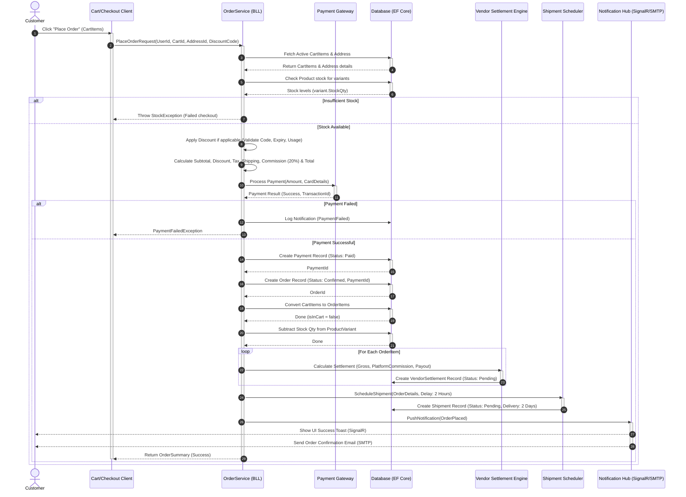
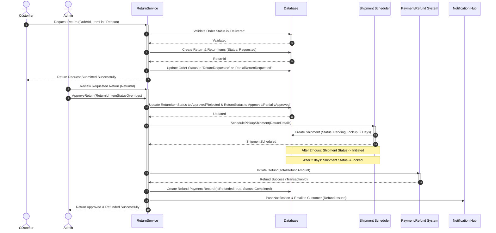
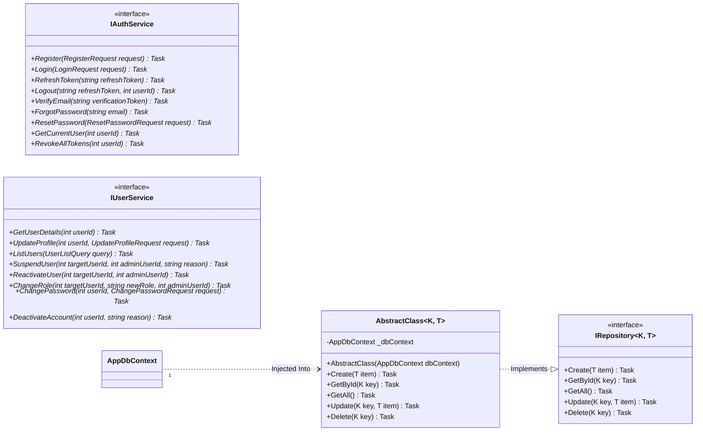

# E-Commerce Platform Technical Design Document

This technical design document outlines the architectural specifications, core data structures, interface designs, use cases, and complex operational workflows for the **Multi-Vendor E-Commerce Application**. 

---

## 1. Class Diagram

The following diagram illustrates all domain models inside `Ecommerce.Models`, including their internal structures, properties, C# types, and relational cardinality (1-to-1, 1-to-many, self-referencing).

```mermaid
classDiagram
    direction TB

    %% Enums
    class UserRole {
        <<enumeration>>
        Customer
        Vendor
        Admin
    }
    class VendorStatus {
        <<enumeration>>
        Pending
        Approved
        Suspended
    }
    class ProductStatus {
        <<enumeration>>
        Draft
        Active
        Archived
    }
    class OrderStatus {
        <<enumeration>>
        Confirmed
        Shipped
        Delivered
        Cancelled
        ReturnRequested
        Returned
        PartialReturnRequested
        PartiallyReturned
    }
    class PaymentStatus {
        <<enumeration>>
        Pending
        Paid
        Failed
        Refunded
    }
    class ShipmentStatus {
        <<enumeration>>
        Pending
        Initiated
        Delivered
        Picked
        Cancelled
    }
    class ReturnStatus {
        <<enumeration>>
        Requested
        Approved
        PartiallyApproved
        Picked
        Rejected
    }
    class ReturnItemStatus {
        <<enumeration>>
        Requested
        Approved
        Rejected
    }
    class ReturnItemRefundStatus {
        <<enumeration>>
        Pending
        Refunded
        Failed
    }
    class DiscountType {
        <<enumeration>>
        Percentage
        Flat
    }
    class SettlementStatus {
        <<enumeration>>
        Pending
        Paid
        Failed
    }
    class NotificationType {
        <<enumeration>>
        OrderPlaced
        OrderShipped
        OrderDelivered
        PaymentFailed
        PriceDrop
        FlashSale
        ReviewApproved
        VendorApproved
    }
    class NotificationLevel {
        <<enumeration>>
        Info
        Success
        Warning
        Error
    }

    %% Domain Models
    class User {
        +int Id
        +string Email
        +string PasswordHash
        +string FullName
        +UserRole Role
        +bool IsActive
        +DateTime CreatedAt
    }
    
    class RefreshToken {
        +int Id
        +int UserId
        +string Token
        +DateTime ExpiresAt
        +bool IsRevoked
    }

    class UserAddress {
        +int Id
        +int UserId
        +string RecipientName
        +string Phone
        +string Line1
        +string Line2
        +string Landmark
        +string City
        +string State
        +string PostalCode
        +string CountryCode
        +string Label
    }

    class Vendor {
        +int Id
        +int UserId
        +string StoreName
        +string StoreEmail
        +string GSTNumber
        +string PANNumber
        +string Description
        +VendorStatus Status
        +string LogoUrl
        +DateTime ApprovedAt
    }

    class Category {
        +int Id
        +string Name
        +int ParentId
    }

    class Product {
        +int Id
        +int VendorId
        +int CategoryId
        +string Name
        +string Description
        +ProductStatus Status
        +DateTime CreatedAt
    }

    class ProductVariant {
        +int Id
        +int ProductId
        +int StockQty
        +decimal Price
        +bool IsDefault
        +bool IsActive
        +string AvailableValues
    }

    class DuplicateProductVariant {
        +int Id
        +int ProductId
        +string Label
        +string Value
        +decimal PriceDelta
        +int StockQty
        +bool IsActive
    }

    class ProductImage {
        +int Id
        +int VariantId
        +string ImageUrl
        +int ImageOrder
    }

    class Cart {
        +int Id
        +int UserId
        +DateTime UpdatedAt
    }

    class CartItem {
        +int Id
        +int CartId
        +int VariantId
        +int Quantity
        +bool isInCart
        +bool isInStock
    }

    class Discount {
        +int Id
        +int VendorId
        +int ProductId
        +int CategoryId
        +string Code
        +DiscountType Type
        +decimal Value
        +decimal MinOrderValue
        +int UsageLimit
        +int UsedCount
        +bool IsActive
        +DateTime ExpiresAt
    }

    class Order {
        +int Id
        +int UserId
        +int DiscountId
        +int ShipmentId
        +int PaymentId
        +decimal Subtotal
        +decimal DiscountAmount
        +decimal TaxAmount
        +decimal ShippingAmount
        +decimal PlatormCommission
        +decimal Total
        +OrderStatus Status
        +PaymentStatus OrderPaymentStatus
        +DateTime PlacedAt
    }

    class OrderItem {
        +int Id
        +int OrderId
        +int VariantId
        +int Quantity
        +decimal UnitPrice
    }

    class Shipment {
        +int Id
        +string TrackingNumber
        +int UserAddressId
        +DateTime EstimatedFullfillement
        +DateTime ShippedAt
        +DateTime FulfilledAt
        +ShipmentStatus Status
    }

    class Payment {
        +int Id
        +decimal Amount
        +string TransactionId
        +PaymentStatus Status
        +DateTime PaidAt
    }

    class Return {
        +int Id
        +string ReturnNumber
        +int OrderId
        +int ShipmentId
        +int PaymentId
        +string Reason
        +ReturnStatus Status
        +decimal TotalRefundAmount
        +bool IsRefunded
        +DateTime RequestedAt
        +DateTime CompletedAt
    }

    class ReturnItem {
        +int Id
        +int ReturnId
        +ReturnItemStatus Status
        +ReturnItemRefundStatus RefundStatus
        +int OrderItemId
        +string Reason
        +int Quantity
        +decimal UnitPrice
        +decimal RefundAmount
    }

    class Review {
        +int Id
        +int ProductId
        +int UserId
        +int OrderId
        +int Rating
        +string Title
        +string Body
        +DateTime CreatedAt
    }

    class ReviewImage {
        +int Id
        +int ReviewId
        +string ImageUrl
        +int ImageOrder
    }

    class Wishlist {
        +int Id
        +int UserId
        +bool IsPublic
    }

    class WishlistItem {
        +int Id
        +int WishlistId
        +int VariantId
        +int ProductVariantId
        +DateTime AddedAt
    }

    class Notification {
        +int Id
        +int UserId
        +NotificationType Type
        +NotificationLevel Level
        +string Title
        +string Message
        +bool IsRead
        +DateTime CreatedAt
    }

    class VendorSettlement {
        +int Id
        +int VendorId
        +int OrderId
        +decimal GrossAmount
        +decimal VendorDiscountAmount
        +decimal PlatformCommissionAmount
        +decimal NetPayoutAmount
        +SettlementStatus Status
        +DateTime SettledAt
    }

    %% Relationships
    User "1" --> "0..1" Vendor : Has
    User "1" --> "0..1" Cart : Has
    User "1" --> "*" UserAddress : Registers
    User "1" --> "*" Order : Places
    User "1" --> "*" Review : Submits
    User "1" --> "*" Wishlist : Manages
    User "1" --> "*" Notification : Receives
    User "1" --> "*" RefreshToken : Authenticates
    User "1" --> "1" UserRole : HasRole

    Vendor "1" --> "*" VendorSettlement : ReceivesPayouts
    Vendor "1" --> "*" Product : Lists
    Vendor "1" --> "*" Discount : Creates
    Vendor "1" --> "1" VendorStatus : Status

    Category "1" --> "*" Product : Groups
    Category "0..1" --> "*" Category : Children

    Product "1" --> "*" ProductVariant : Has
    Product "1" --> "*" DuplicateProductVariant : AlternativeModel
    Product "1" --> "*" Review : RatedBy
    Product "1" --> "1" ProductStatus : Status

    ProductVariant "1" --> "*" ProductImage : HasImages
    ProductVariant "1" --> "*" CartItem : AddedToCart
    ProductVariant "1" --> "*" OrderItem : OrderedIn
    ProductVariant "1" --> "*" WishlistItem : WishedIn

    Cart "1" --> "*" CartItem : Contains

    Discount "1" --> "*" Order : AppliedTo
    Discount "1" --> "1" DiscountType : Type

    Order "1" --> "*" OrderItem : Contains
    Order "1" --> "0..1" Shipment : DeliveredBy
    Order "1" --> "1" Payment : FundedBy
    Order "1" --> "*" VendorSettlement : SplitsPayout
    Order "1" --> "*" Return : ReturnedThrough
    Order "1" --> "1" OrderStatus : Status

    OrderItem "1" --> "*" ReturnItem : ReturnedIn

    Shipment "1" --> "1" UserAddress : ShippedTo
    Shipment "1" --> "1" ShipmentStatus : Status

    Payment "1" --> "0..1" Order : PaysFor
    Payment "1" --> "0..1" Return : RefundsFor
    Payment "1" --> "1" PaymentStatus : Status

    Return "1" --> "*" ReturnItem : Contains
    Return "1" --> "1" Shipment : PickedUpBy
    Return "1" --> "1" Payment : RefundedVia
    Return "1" --> "1" ReturnStatus : Status
    ReturnItem "1" --> "1" ReturnItemStatus : ItemStatus
    ReturnItem "1" --> "1" ReturnItemRefundStatus : RefundStatus

    Review "1" --> "*" ReviewImage : HasImages

    Wishlist "1" --> "*" WishlistItem : Contains

    Notification "1" --> "1" NotificationLevel : Level
    Notification "1" --> "1" NotificationType : Type

    VendorSettlement "1" --> "1" Vendor : PaidTo
    VendorSettlement "1" --> "1" Order : OriginatesFrom
    VendorSettlement "1" --> "1" SettlementStatus : Status
```

---

## 2. Use Case Diagram

The use case diagram highlights the system entry points and workflows segmented by roles: **Customer**, **Vendor**, and **Admin**.

```mermaid
graph TB
    subgraph Roles
        C[Customer]
        V[Vendor]
        A[Admin]
    end

    subgraph System Use Cases
        %% Customer Use Cases
        UC1[Register & Verify Email]
        UC2[Login & Session Management]
        UC3[Manage Shopping Cart]
        UC4[Apply Discounts]
        UC5[Place Order & Pay]
        UC6[Cancel Order & Refund]
        UC7[Request Return]
        UC8[Add Product Reviews & Images]
        UC9[Manage Wishlist]
        
        %% Vendor Use Cases
        UC10[Register & Validate GST/PAN]
        UC11[Update Store Profile]
        UC12[Create Vendor Discounts]
        UC13[Manage Products & Variants]
        UC14[View Vendor Order History]
        UC15[View Product Returns & Reviews]
        UC16[Track Financial Settlements]
        
        %% Admin Use Cases
        UC17[Approve / Suspend Vendor]
        UC18[Oversight: Masked PII Access]
        UC19[Create Platform Admins]
        UC20[Create Platform Categories & Discounts]
        UC21[Approve / Reject Returns]
        UC22[View Financial Audits & Platform Commission]
    end

    %% Customer Connections
    C --> UC1
    C --> UC2
    C --> UC3
    C --> UC4
    C --> UC5
    C --> UC6
    C --> UC7
    C --> UC8
    C --> UC9

    %% Vendor Connections
    V --> UC10
    V --> UC11
    V --> UC12
    V --> UC13
    V --> UC14
    V --> UC15
    V --> UC16

    %% Admin Connections
    A --> UC17
    A --> UC18
    A --> UC19
    A --> UC20
    A --> UC21
    A --> UC22
```

---

## 3. Sequence Diagrams

### 3.1 Place Order Workflow (Checkout Transaction)

This diagram details the transaction flow, highlighting how stock verification, payment gateways, database state transitions, vendor commission splitting, shipment schedules, and background notifications interact.

---

### 3.2 Return Order Workflow

This diagram models the return process where customers request refunds, admins approve them, and asynchronous pickup and refund workflows execute.

---

## 4. Interface Diagram

This diagram displays the project's design pattern implementation: Dependency Inversion (interface contracts) and the Generic Repository pattern.

---

## 5. Detailed System Workflows

This section outlines step-by-step logic, validations, state transitions, notifications, and background processes executed for each role.

### 5.1 Customer Workflows

#### 5.1.1 Registration & Email Verification
1. **Request Payload**: Customer provides full name, email, password, and address details during the register step (`RegisterDTO`).
2. **Password Hashing**: The system uses **BCrypt** to hash the password before saving (`PasswordHash`).
3. **Pending State**: A new `User` is created with `IsActive = true` (or false if email validation is mandatory before active status) and role `UserRole.Customer`.
4. **OTP Creation**: A notification triggers a 6-digit OTP sent to the user's email (`NotificationType.EmailVerification`).
5. **Address Injection**: The address details provided are added to `UserAddress` immediately, mapped to the newly created `UserId`.
6. **Confirmation**: Upon submitting the valid OTP, an OTP confirmation email is dispatched (`NotificationType.EmailConfirmation`).

#### 5.1.2 Authentication & Login
1. **Credentials verification**: Customer inputs email and password (`LoginDTO`).
2. **Token Generation**: System generates a standard cryptographically signed **JWT token** containing the `UserId` and `Role` as claims. Expire window is strictly set to **7 days**.
3. **Session Store**: The system generates a highly secure random `RefreshToken` saved in the database with `ExpiresAt = DateTime.Now.AddDays(7)` and `IsRevoked = false`.

#### 5.1.3 Cart Operations
1. **View Cart**: Fetches the active `Cart` linked to the `UserId`, pulling associated `CartItems` where `isInCart = true`.
2. **Add Item**: Checks the `ProductVariant` table to verify if `StockQty >= requestedQuantity`. If valid, it adds a `CartItem` record (or updates quantity).
3. **Quantity Updates**: 
   - Increments verify stock availability: if `StockQty < (Quantity + 1)`, it returns a bad request.
   - Decrements are allowed. If the quantity reaches `0`, it triggers **Remove from Cart** (soft delete: set `isInCart = false`).

#### 5.1.4 Checkout, Order Placement & Payments
1. **Pre-checkout checks**: Validates all items in the cart are in stock (`isInStock = true`).
2. **Discount Evaluation**: If a promotional discount code is provided:
   - Validates that the discount code is active (`IsActive == true`), usage limit has not been exceeded (`UsedCount < UsageLimit`), and current date is before `ExpiresAt`.
   - Validates `subtotal >= MinOrderValue`.
3. **Financial Math**: 
   - `Subtotal` = sum of `UnitPrice * Quantity` of active cart items.
   - `DiscountAmount` = calculated based on `DiscountType` (Percentage or Flat).
   - Platform commission is computed at **20%** (`PlatormCommission`).
   - `Total` = `Subtotal - DiscountAmount + TaxAmount + ShippingAmount`.
4. **Payment Gateway Call**: Customer triggers payment. The system creates a `Payment` record with state `PaymentStatus.Pending`. If successful, the status changes to `Paid` and saves a `TransactionId`.
5. **Order Creation**: Once payment is verified, the system generates an `Order` with `OrderStatus.Confirmed`, maps the active `PaymentId`, and copies cart items into the `OrderItem` table.
6. **Inventory Adjustments**: Subtracts the purchase quantities from each variant's `StockQty` in the `ProductVariants` database.
7. **Platform/Vendor Splits**: Automatically triggers vendor calculations. For each item, `GrossAmount = UnitPrice * Quantity`. Net Vendor Payout `NetPayout = GrossAmount - PlatformCommissionAmount - VendorDiscountShare`. A `VendorSettlement` record is created for each vendor with state `Pending`.
8. **Shipment Scheduling**: 
   - Creates a `Shipment` record with status `Pending` and estimated delivery of `DateTime.Now.AddDays(2)`.
   - Mapped under `EstimatedFullfillement`.
   - A background delay trigger changes the shipment status to `Initiated` after **2 hours**.
9. **Real-time Notifications**: Triggers a SignalR push notification toast to the client showing "Order Confirmed!" (`NotificationType.OrderPlaced`) and sends an order receipt email.

#### 5.1.5 Order Cancellations
1. **Validation**: An order can be canceled only if `OrderStatus` is either `Confirmed` or `Shipped`.
2. **Refund Rules**:
   - If cancelled when `OrderStatus == Confirmed` (before the 2-hour shipment initiation delay), a **100% refund** is issued to the customer.
   - If cancelled when `Shipment.Status == Initiated` (after 2 hours but before delivery):
     - Shipping charges are **non-refundable**.
     - If cancellation occurs inside the final **24-hour window** of the estimated delivery date, a **20% cancellation penalty** is deducted from the refund amount.
3. **Database Changes**: The order moves to `OrderStatus.Cancelled`, payment moves to `PaymentStatus.Refunded`, and `Shipment.Status` moves to `Cancelled`. Stock is restored back to the variants.

#### 5.1.6 Returns
1. **Validation**: Returns are only allowed if `OrderStatus == Delivered`.
2. **Return Request**: Customer creates a `Return` referencing `OrderId` and specifies individual `ReturnItems` with quantity and reason.
3. **Status Transitions**: The `Return.Status` is marked as `Requested`. The parent order is updated to `ReturnRequested` or `PartialReturnRequested`.
4. **Background Schedules**:
   - On creation, a pickup shipment is scheduled (`ShipmentStatus.Pending`) with a pickup date in 2 days.
   - Once approved by Admin: after 2 days, status transitions to `Picked`. The return's `IsRefunded` becomes `true`, and the return moves to completed status (`CompletedAt = DateTime.Now`).

#### 5.1.7 Reviews
1. Customer can write a `Review` for products they purchased (`Rating`, `Title`, `Body`).
2. Can attach associated images (`ReviewImage`). These are stored with an order index (`ImageOrder`) to maintain client-side presentation layouts.

---

### 5.2 Vendor Workflows

#### 5.2.1 Vendor Registration
1. **Signup DTO**: Vendor submits standard registration payload with basic store parameters.
2. **Government Checks**: System checks the validation formatting of the **GST Number** (15 characters) and **PAN Number** (10 characters).
3. **Under Review**: Vendor is logged in the database under `VendorStatus.Pending`.

#### 5.2.2 Product & Inventory Management
1. **Product Creation**: Post `Product` details -> Post `ProductImages` -> Define one or more `ProductVariants`.
2. **Variant Management**: Variants are configured with separate pricing (`Price`), physical stock (`StockQty`), a default boolean (`IsDefault`), and custom metadata combinations saved as a **PostgreSQL jsonb dictionary** (`AvailableValues`).
3. **Variant Archival**: Archiving a variant sets `IsActive = false` (preventing future checkouts, maintaining integrity for existing orders).
4. **Image Management**: Post `ProductImage` mapped to `VariantId` with integer sorting order (`ImageOrder`). Archiving an image marks it as `Archived`.

#### 5.2.3 Vendor Operations & Settlements
1. **Promotional Discounts**: Create discounts linked to `VendorId`. If `ProductId` is specified, the discount applies only to that product. Otherwise, it applies across the vendor's entire catalog.
2. **Order History**: Pulls `OrderItems` matching any of the vendor's `ProductIds`. Active orders filter for statuses: `Confirmed` or `Shipped`.
3. **Return Tracking**: Displays returns on their products where order status represents return states (`ReturnRequested`, `Returned`, etc.).
4. **Review Feeds**: Shows reviews submitted for the vendor's products.
5. **Settlement Ledgers**: Displays settlement statements representing items sold (`GrossAmount`, `PlatformCommissionAmount`, and `NetPayoutAmount`) filtered by payment status (`Pending`, `Paid`, `Failed`).

---

### 5.3 Admin Workflows

#### 5.3.1 Vendor Governance
1. **Approvals**: Fetches vendors with status `Pending`. Admin reviews the store, validating the masked **GST Number** and **PAN Number**. When the Admin clicks Approve, `Status = Approved`, `ApprovedAt` is logged, and an approval notification is dispatched (`NotificationType.VendorApproved`).
2. **Suspensions**: Admin can flag a vendor as `Suspended` for policy violations. Dispatches an email notification explaining the reason, and archives their listed products immediately.

#### 5.3.2 Catalog & Platform Moderation
1. **PII Masking**: For data security regulations, general customer lists mask emails, passwords, and phone numbers. Vendor lists mask PAN and GST strings.
2. **Platform Promotions**: Admin can create platform-wide categories and platform-wide discounts.
3. **Platform Metrics**: 
   - Tracks total platform profit: Sum of flat `PlatformCommission` on orders + `PlatformCommissionAmount` recorded across vendor settlements.
   - Overall payment logs: Retrieves transaction histories sorted descending by date (`PaidAt`) with status filter.

#### 5.3.3 Return Approvals & Processing
1. **Pending Approvals**: Admin views all pending return requests (`ReturnStatus.Requested`).
2. **Moderation**: Admin can approve or reject return items individually:
   - For approved items: updates `ReturnItemStatus.Approved` and initiates refund computation (`ReturnItemRefundStatus.Refunded` upon payout release).
   - For rejected items: updates `ReturnItemStatus.Rejected`.
3. **Refund Disbursal**: Executes payment refunds and notifies the customer.
